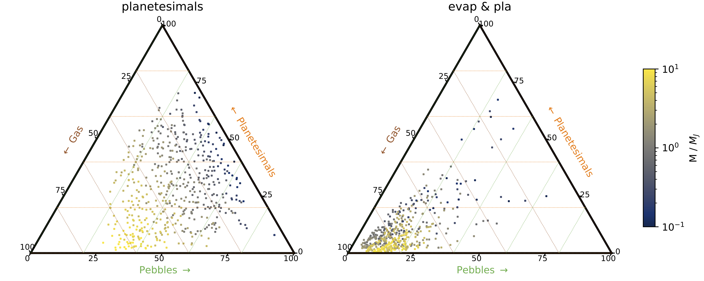
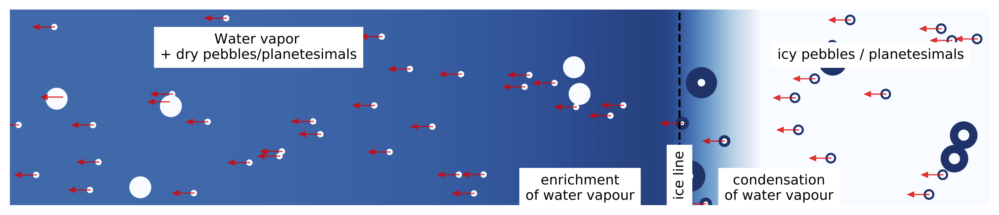
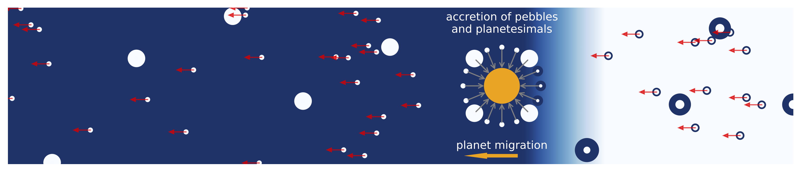
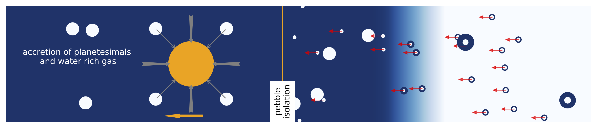

# Welcome to the chemcomp wiki

*Modeling the chemical composition of gas giants by accretion of pebbles, planetesimals and gas.*

`chemcomp` is a python code that aims to enable the study the formation of planets in 1D protoplanetary disks. 

Included disk physics:
- viscous disk evolution [(e.g. Lynden-Bell & Pringle 1974)](https://ui.adsabs.harvard.edu/abs/1974MNRAS.168..603L/abstract)
- pebble growth & evolution applying the two populations model [(Birnstiel et al. 2012)](https://ui.adsabs.harvard.edu/abs/2012A%26A...539A.148B/abstract)
- planetesimal formation [(Lenz et al. 2019)](https://ui.adsabs.harvard.edu/abs/2019ApJ...874...36L/abstract)
- evaporation and condensation at evaporation lines (Schneider & Bitsch 2020)
- viscous heating [(e.g. Armitage 2013)](https://ui.adsabs.harvard.edu/abs/2013apf..book.....A/abstract)
- chemical compositions (Schneider & Bitsch 2020)

Included planet physics:
- type-I migration [(Paardekooper et al. 2011)](https://ui.adsabs.harvard.edu/abs/2011MNRAS.410..293P/abstract)
- type-II migration [(Kanagawa et al. 2018)](https://ui.adsabs.harvard.edu/abs/2018ApJ...861..140K/abstract)
- thermal torque [(Masset et al. 2017)](https://ui.adsabs.harvard.edu/abs/2017MNRAS.472.4204M/abstract)
- Dynamical torques [(Paardekooper et al. 2014)](https://ui.adsabs.harvard.edu/abs/2014MNRAS.444.2031P/abstract)
- Pebble Accretion [(Johansen & Lambrechts 2017)](https://ui.adsabs.harvard.edu/abs/2017AREPS..45..359J/abstract)
- Planetesimal Accretion [(Johansen & Bitsch 2019)](https://ui.adsabs.harvard.edu/abs/2019A%26A...631A..70J/abstract)
- Gas accretion ([Machida et al. 2010](https://ui.adsabs.harvard.edu/abs/2010MNRAS.405.1227M/abstract), [Bitsch et al. 2015](https://ui.adsabs.harvard.edu/abs/2015A%26A...582A.112B/abstract), [Bergez-Casalou et al. 2020](https://ui.adsabs.harvard.edu/abs/2020arXiv201000485B/abstract))

|  |
| *Phase 1: Dust particles grow to pebbles (small dots) and drift towards the star while forming planetesimals (large dots). Icy pebbles that cross the water ice line (dashed line) evaporate their water content and enrich the gas with water vapour. Water vapour that crosses the ice line condenses onto pebbles increasing their water content.* |
|  |
| *Phase 2: The core of the planet is formed by pebble and planetesimal accretion while the planet migrates. Depending on the formation path, the core composition can be icy or dry.* |
|  |
| *Phase 3: Once the planet is heavy enough to reach pebble isolation and form a pressure bump, pebbles are stoped and can not be accreted by the planet. The planet will then accrete water rich gas while still accreting planetesimals that ablate in the atmosphere of the planet.* |
|:--:| 
| *Phases of planetary growth. The water content of the disk (in solid or gaseous form) is color coded, where a darker color indicates a larger water content. We restrict ourselves in this cartoon to the water evaporation front, but the same applies for the evaporation of all solids in our model.* |

The physical model is in depth explained in Schneider & Bitsch (2020). This wiki is only meant for explanations on the structure of `chemcomp`.
