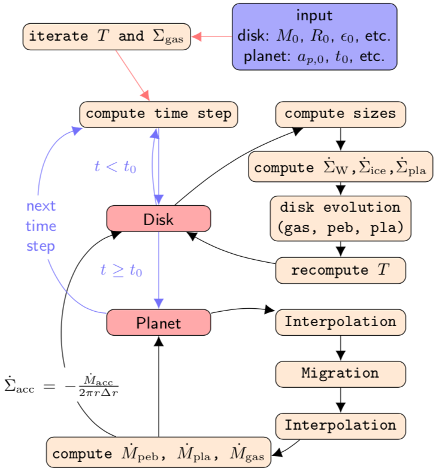

{:height="50%" width="50%"}

Operating principle of chemcomp. The main loop is shown in blue. Black arrows connect individual steps (beige nodes) that are performed in each time step. Red arrows indicate initialisation steps.